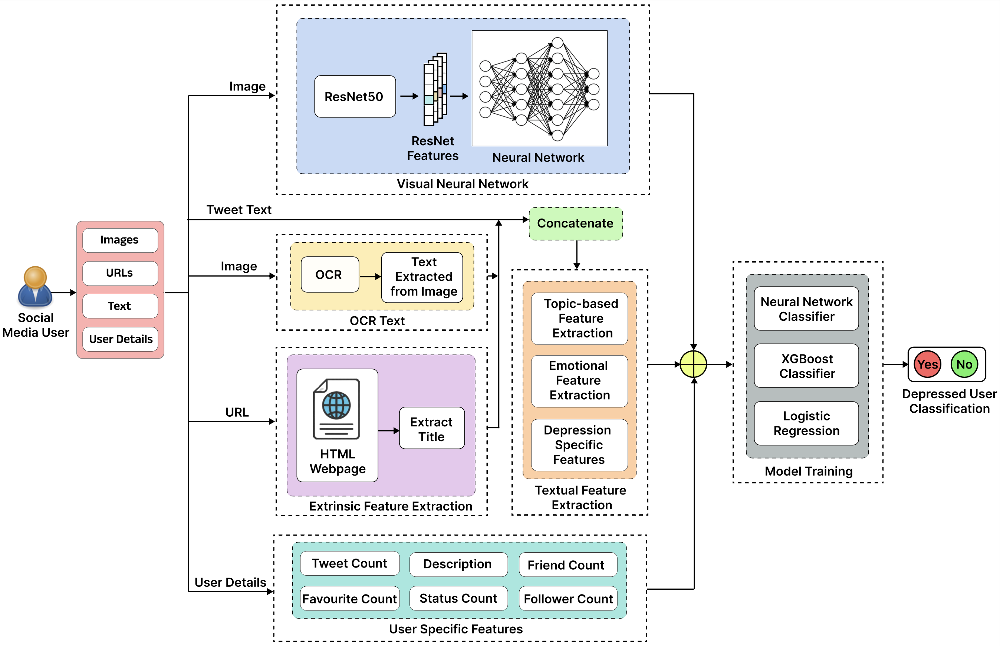

<div align="center">

## A Multimodal Framework for Depression Detection During COVID-19 via Harvesting Social Media

<div>
    Ashutosh Anshul, Gumpili Sai Pranav, Mohammad Zia Ur Rehman, Nagendra Kumar
</div>
<div>
    Indian Institute of Technology Indore
</div>

<br>

<p align="center">

    <h4 align="center">System architecture of the proposed model</h4>
</p>


</div>

<h3>If you find this data useful for your research, please kindly star our repo and cite our paper.</h3>

## Abstract

The recent coronavirus disease (COVID-19) has become a pandemic and has affected the entire globe. During the pandemic, we have observed a spike in cases related to mental health, such as anxiety, stress, and depression. Depression significantly influences most diseases worldwide, making it difficult to detect mental health conditions in people due to unawareness and unwillingness to consult a doctor. However, nowadays, people extensively use online social media platforms to express their emotions and thoughts. Hence, social media platforms are now becoming a large data source that can be utilized for detecting depression and mental illness. However, the existing approaches often overlook data sparsity in tweets and the multimodal aspects of social media. In this article, we propose a novel multimodal framework that combines textual, user-specific, and image analysis to detect depression among social media users. To provide enough context about the user’s emotional state, we propose the following: 1) an extrinsic feature by harnessing the URLs present in tweets and 2) extracting textual content present in images posted in tweets. We also extract five sets of features belonging to different modalities to describe a user. In addition, we introduce a deep learning model, the visual neural network (VNN), to generate embeddings of user-posted images, which are used to create the visual feature vector for prediction. We contribute a curated COVID-19 dataset of depressed and nondepressed users for research purposes and demonstrate the effectiveness of our model in detecting depression during the COVID-19 outbreak. Our model outperforms the existing state-of-the-art methods over a benchmark dataset by 2%–8% and produces promising results on the COVID-19 dataset. Our analysis highlights the impact of each modality and provides valuable insights into users’ mental and emotional states.

## Covid-19 Dataset

Due to the recent data-sharing policy, we cannot share the entire dataset, including the user and tweet data. However, we are sharing the user-level features and average of tweet-level features (Topic-Based Feature, Visual Feature, Emotional Feature, Depression-Specific Feature) into the CSV with appropriate feature names as columns, without exposing the user ID or tweet ID. Hopefully, the data serves enough for any possible research. If you have any doubts about data collection and features, please contact Ashutosh Anshul (ashutoshanshul01@gmail.com).

## Citation
If you find this work useful for your research, please kindly cite our paper:
```
@ARTICLE{10241281,
  author={Anshul, Ashutosh and Pranav, Gumpili Sai and Rehman, Mohammad Zia Ur and Kumar, Nagendra},
  journal={IEEE Transactions on Computational Social Systems}, 
  title={A Multimodal Framework for Depression Detection During COVID-19 via Harvesting Social Media}, 
  year={2024},
  volume={11},
  number={2},
  pages={2872-2888},
  keywords={Depression;Feature extraction;Social networking (online);COVID-19;Blogs;Visualization;Surveys;Coronavirus disease (COVID-19);deep learning;depression;machine learning;multimodal analysis;social media},
  doi={10.1109/TCSS.2023.3309229}}


```
  
